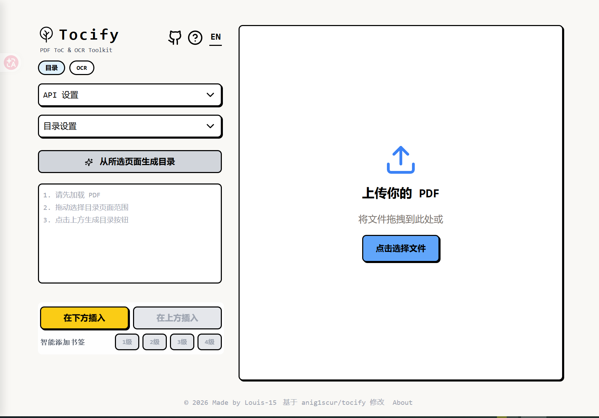
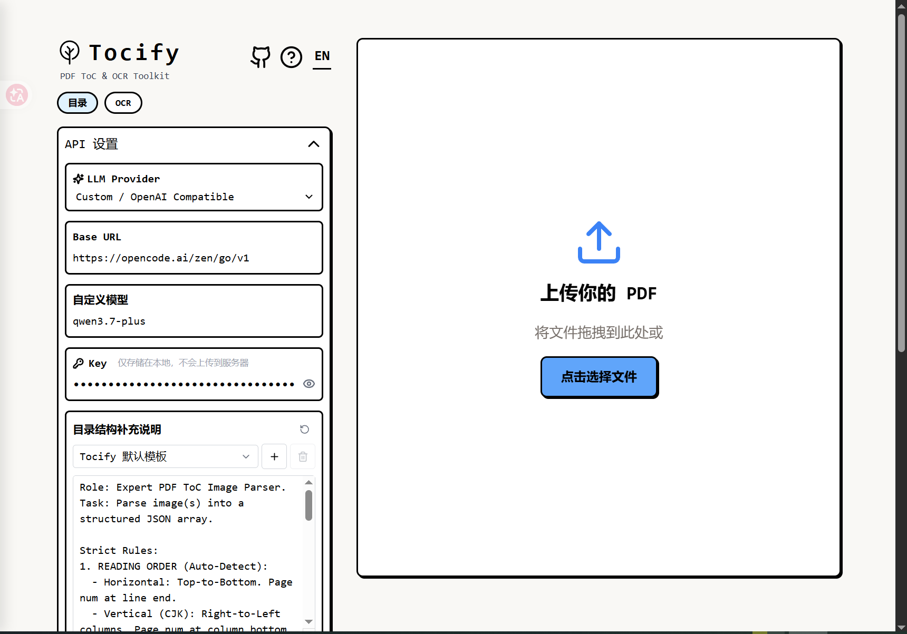
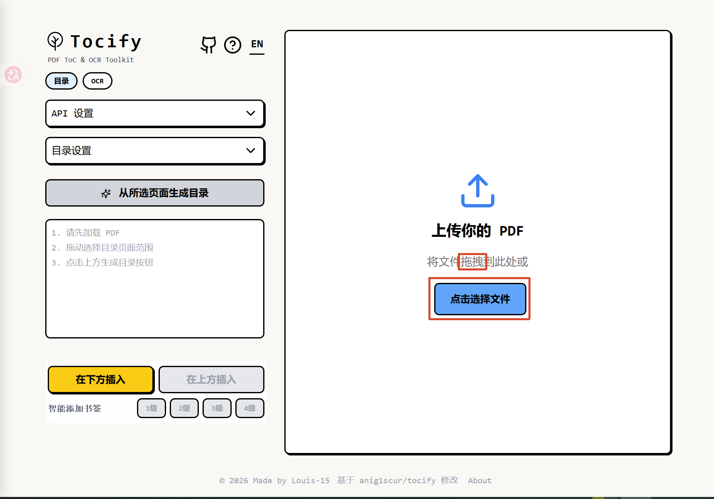
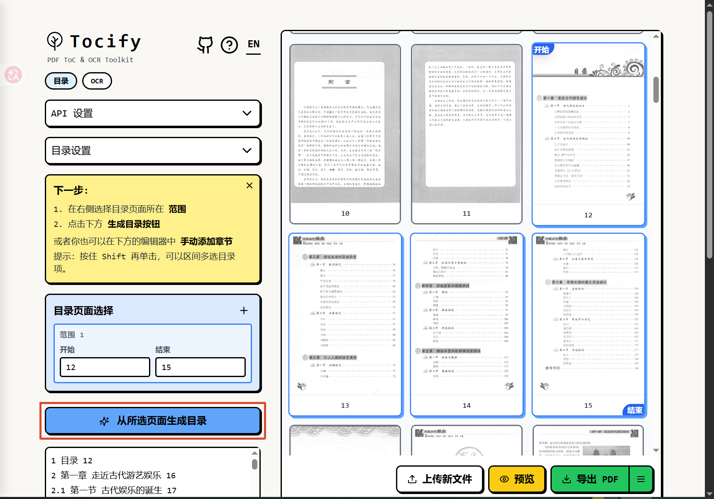
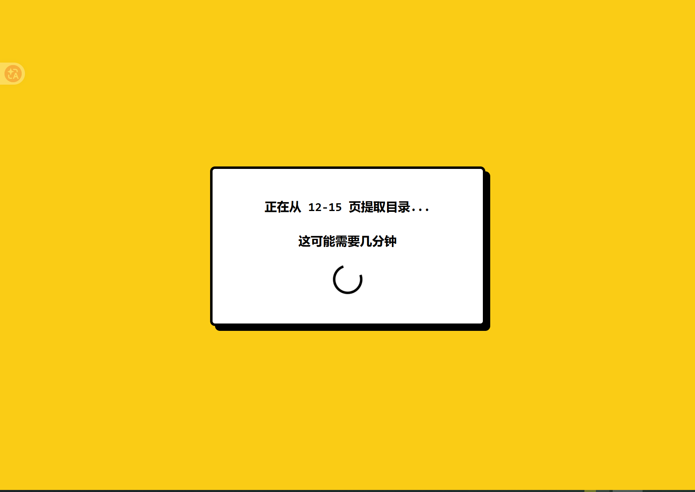
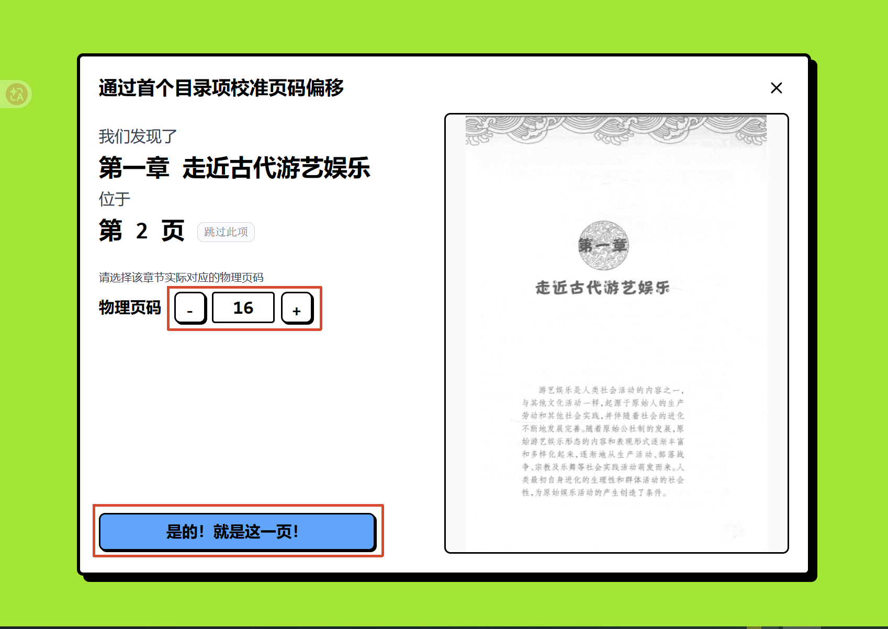
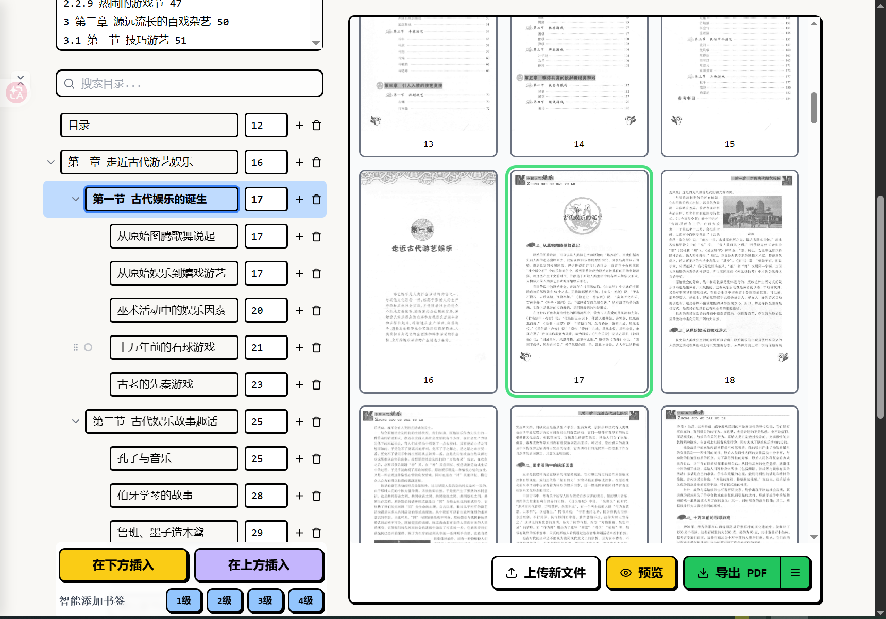
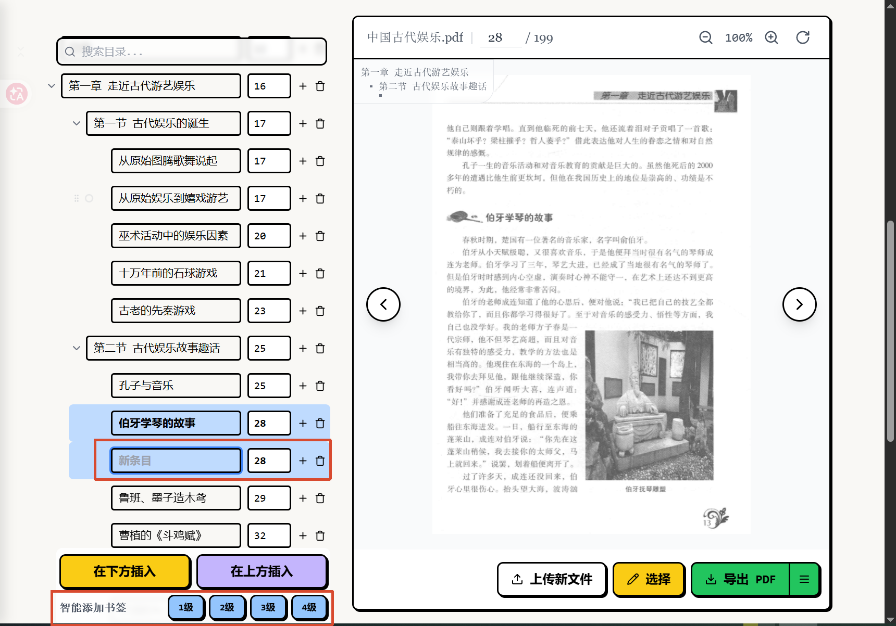
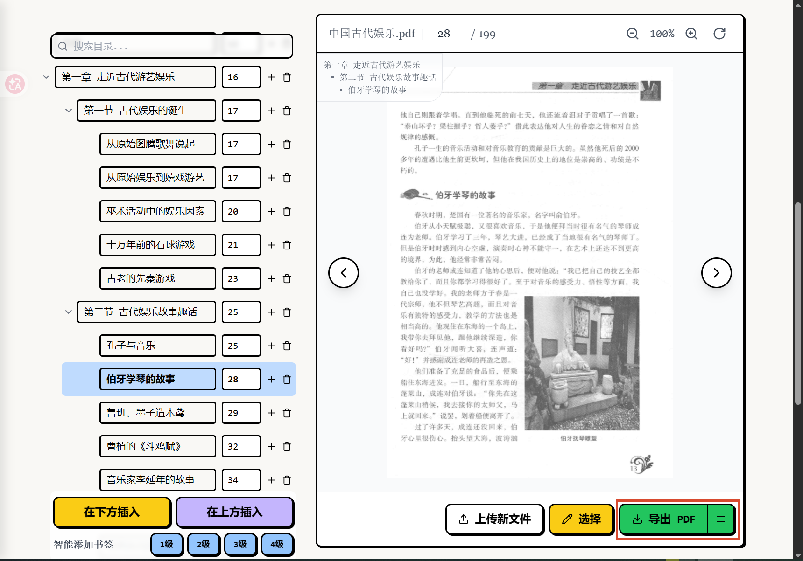

# Tocify 使用指南（网页版）

一个免费、开源、在线的 PDF 目录（书签）生成工具。利用 AI 解析扫描版目录图片，自动生成可点击的书签与可打印的目录页。

> **本项目** 基于 [anig1scur/tocify](https://github.com/anig1scur/tocify)（GPL-3.0）修改而来。

---

## 准备工作

- **电脑**：Windows 10/11
- **网络**：首次运行需要联网（安装依赖，后续除 AI 识别外可离线使用）
- **需要添加目录的扫描版 PDF**：最好要有纸质目录页

---

## 一、解压与安装

1. 下载 `Tocify-网页版.zip` 压缩包。
2. 将压缩包**解压到任意目录**（例如 `D:\Tocify`）。**注意：建议不要解压到 `C:\Program Files` 等系统目录**，因为程序需要读写权限。
3. 解压后出现以下文件：

```
Tocify/
├── 启动Tocify.bat       ← 双击这个开始
├── src/                 ← 源码
├── static/              ← 静态资源（含 OCR 模型）
├── package.json ...
└── ...
```

---

## 二、启动服务

1. 双击 **`启动Tocify.bat`**（首次运行会自动：
   - 检查 Node.js 环境（没有会提示你去 https://nodejs.org 下载安装）
   - 自动安装 pnpm 和项目依赖（需联网，约 3-10 分钟，请耐心等待）
   - 然后自动启动服务）
2. 弹出的黑色命令行窗口**就是服务窗口**，它会一直保持打开：
   - 服务就绪后**自动打开浏览器**访问 `http://localhost:5173`（若没自动打开，手动在浏览器输入该地址即可）
   - 窗口里显示的是服务运行日志，属正常现象，无需关心
3. **停止服务**：直接关闭这个黑色窗口即可。

> **注意**：使用期间请保持该窗口开启。只要浏览器能打开 Tocify 页面，就说明服务运行正常。



---

## 三、第一次使用：配置 AI API

点击页面**左上角的"API 设置"**，展开配置面板：

### 1. 选择 LLM Provider（服务商）
- 下拉选择 **"API 提供商"**
- 支持：Gemini、Qwen、Doubao、Zhipu、自定义聚合中转平台（OpenAI 兼容接口，如 OpenCodeGo、Command Code 等）
- 注意：需要选择能识图的模型

### 2. 填写 Base URL
> ⚠️ **重要**：Base URL 只需写到 **`/v1`** 即可，**不要写 `/chat/completions`**，软件会自动补全后面的路径。

| 写什么 | 是否正确 |
|--------|----------|
| `https://api.example.com/v1` | ✅ 正确 |
| `https://api.example.com/v1/chat/completions` | ❌ 错误（多写路径易导致请求失败） |

### 3. 填写 API Key
- 在 **Key** 输入框中粘贴你的 API Key（只保存在本地浏览器，不会上传服务器）

### 4. 填写自定义模型名（Custom Model）
- 如 `gpt-4o`、`qwen3.7-plus` 等（取决于你的 API 提供商支持的模型）

### 5. 保存
点击 **"保存"** 按钮。



---

## 四、上传 PDF

1. 点击页面右侧 **"上传你的 PDF"** 区域。
2. 选择要添加目录的 PDF 文件；或直接**拖拽 PDF 文件**到该区域。
3. 等待加载完成（大文件可能需要几十秒）。



---

## 五、选择目录所在页面范围

1. 在右侧 PDF 预览（默认网格视图）中，找到**包含目录的页面**（通常是前几页：序言、目录页等）。
2. **按住鼠标左键拖动**，框选目录所在的页面范围（如第 1-5 页）。
3. 如果目录分布在不连续的页面，可以点击 **左侧的"+"按钮** 添加多个范围（如第 1-2 页 + 第 5-6 页）。

> 提示：拖动框选后，左侧会显示"目录页面选择"的起止页码。



---

## 六、点击"生成目录"并等待

1. 点击左侧蓝色按钮 **"从所选页面生成目录"**。
2. 等待 AI 识别（通常几秒到几分钟，取决于页数和目录长度）。
   - 若目录页数较多，会自动分批识别。



---

## 七、根据首个目录项校准页码偏移

> 如果 AI 识别的目录页码与实际物理页有偏差（常见于书籍有封面、序言等前置内容导致），需要校准。

1. 识别完成后，页面会弹出 **"通过首个目录项校准页码偏移"** 窗口。
2. 在右侧预览中核对，并使用 +、- 按钮调节物理页码，使右侧的书页与首个目录项匹配上。
3. 匹配完成后，点击 **"是的！就是这一页！"**。

> 也可以在识别之前，就手动在 **"目录设置" → "页码偏移量"** 中调整（物理页码 - 标注页码 = 偏移量）。



---

## 八、检查生成的目录对齐状况

1. 在左侧编辑器中检查每个目录条目的**标题**与**页码**是否准确。
2. 点击某个目录条目，右侧预览会**跳到对应页**，核对内容是否匹配。
3. 如果有错：
   - 点击页码输入框的**上下箭头**微调页码（右侧实时跳页）
   - 点击标题输入框直接修改标题
   - 拖动条目左侧的**拖拽手柄**调整层级和顺序



---

## 九、手动添加目录条目（可选）

如果 AI 识别遗漏了某部分，如序言、前言等，可以手动补：

### 1. 「智能添加书签」（推荐，可智能定位）
- 在右侧**预览模式**翻到需要添加书签的页面（或编辑模式网格中**框选单独一页**）。
- 点击底部"智能添加书签"旁的 **1级 / 2级 / 3级 / 4级** 按钮。
- 系统会**根据页码和级别自动把新书签插到正确位置**（如第 52 页的 2 级书签会找到最近的同级书签自动归位，无需手动拖拽）。

### 2. 「在下方插入」/「在上方插入」
- 先**单击某个已有目录条目**（选中它，变蓝高亮）作为锚点。
- 点击底部 **"在下方插入"** → 在该条目**下方**插入一条空条目（同层级）。
- 点击 **"在上方插入"** → 在该条目**上方**插入一条空条目。
- 然后输入标题和页码即可。



---

## 十、导出最终 PDF

1. 检查所有目录条目无误后，点击右侧 **"导出 PDF"** 按钮（绿色）。
2. 浏览器会下载**带新目录的 PDF 文件**（文件名通常与原文件名相同或加后缀）。



---

## 常见问题

### 双击 `启动Tocify.bat` 提示找不到 Node.js？
- 到 https://nodejs.org 下载安装 LTS 版本，安装时勾选 "Add to PATH"，然后重新运行脚本。

### Tocify 支持哪些操作和快捷键？
- Ctrl/Cmd + Z: 撤销
- Ctrl/Cmd + Shift + Z: 重做 (撤销撤销)
- 单击圆点或空白区域: 选中目录项
- Shift + 单击: 区间选择目录项
- Delete/Backspace: 删除选中目录项
- 上下键: 快速切换 导航输入框
- 拖动拖拽柄: 拖拽目录项 / 目录组
---

## 开源协议

本项目基于 [anig1scur/tocify](https://github.com/anig1scur/tocify)（GPL-3.0）修改而来，并**整体使用 [GPL-3.0](./LICENSE)** 许可证发布。

- 你可以自由使用、修改、再分发
- 衍生作品必须继续以 GPL-3.0 开源
- 详见 [LICENSE](./LICENSE) 文件
